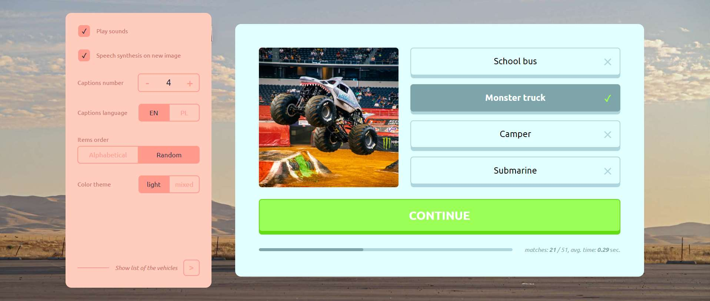
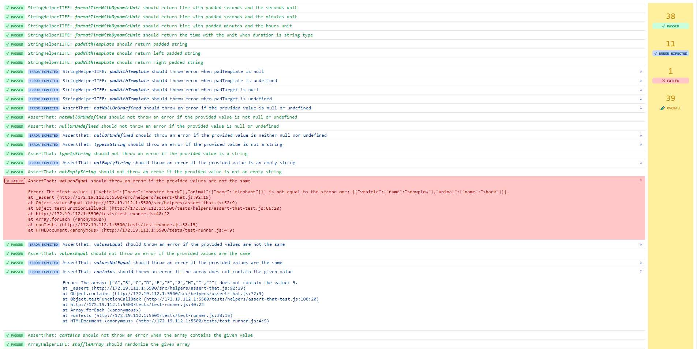

# **Photo and caption** matching game

**A photo** of an item and several **captions** appear. 
One of the captions is the **correct name of the item**. 
**The speech synthesizer** says the correct name.

Your challenge is to **match the caption to the photo**.

<!-- LIVE DEMO -->
## Live demo
Currently best to run on Chrome: 
***https://glowkapracuje.github.io/photo-and-caption-matching-game/***

Running unit tests in a browser. 
Everything has been written from scratch, the project does not use any external library: 
***https://glowkapracuje.github.io/photo-and-caption-matching-game/tests/test-runner.html***

<!-- ROADMAP -->
## Roadmap

- [x] **Allow to change settings**
    - [x] Add input for disabling all sounds
    - [x] Add input for disabling the Speech Synthesis when new item appears  
    - [x] Add input for changing captions number
    - [x] Add input for changing list sorting type
        - [x] Alphabetical
        - [x] Category
        - [x] Random    
    - [x] Add input for changing color theme
        - [x] Light
        - [x] Mixed as temporary solution
        - [ ] Dark 
    - [x] Add input for chosing specific item
    - [x] Place settings on different slides using slider
- [x] **Allow to change the captions language**
    - [x] Add input for changing the language
    - [x] Display translated captions
    - [x] Provide multiple Speech synthesis voices
- [x] **Add progress bar**
- [ ] **Allow to choose between different item lists**
    - [ ] Provide a widget for creating drop down list 
    - [ ] Provide different item lists
        - [x] Vehicles
        - [ ] Animals
    - [ ] Allow Tag widget to be updated on list change 
- [ ] **Improve functionality**
    - [x] Avoid generating random items from the entire list
    - [ ] Create game flow service with improved statuses
- [ ] **Provide different input types**
    - [x] Captions as buttons
    - [ ] Text input field
- [ ] **Reusable widgets**
    - [x] Accordion  
    - [x] Caption
    - [X] Checkbox
    - [ ] List
    - [x] Number spinner
    - [x] Photo
    - [x] Progress bar 
        - [x] Display number of correct answers
        - [x] Measure and display average of matching
    - [x] Radio
    - [x] Slider
    - [x] Tags 
- [ ] **Provide support for browsers other than chrome**
- [ ] **Documentation** 
    - [x] Helpers 
        - [x] Array Helper IIFE module
        - [x] String Helper IIFE module  
        - [x] Assert That Helper IIFE module
    - [ ] Services 
- [x] **Tests** 
    - [x] Introduce an approach for unit tests without external libraries 
        - [x] Test runner using browser 
        - [x] Test result visible on page
            - [x] Mobile view 
            - [x] Display error stack trace (for failed and expected error results) 
        - [x] Separate dev code and app code 

<!-- TECHNICAL STUFF -->
## Technical stuff

* This project does not use any external libriaries. 
* The whole js code has been written using Vanilla JS ( ͡° ͜ʖ ͡°) 

<!-- LICENSE -->
## License

Distributed under the GPL-3.0 License. See `LICENSE` for more information.

(<a href="#readme-top">back to top</a>)
