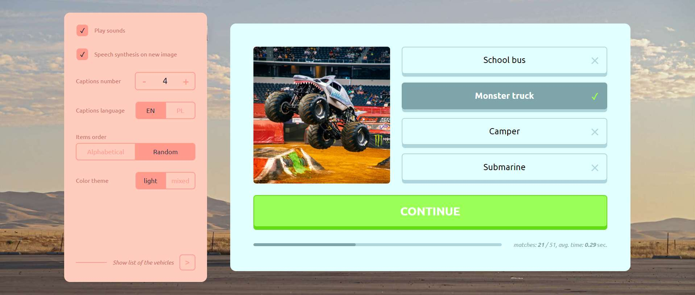

# **Photo and caption** matching game

**A photo** of an item and several **captions** appear. 
One of the captions is the **correct name of the item**. 
**The speech synthesizer** says the correct name.

Your challenge is to **match the name** (caption) **to the photo**.

<!-- LIVE DEMO -->
## Live demo 
based on the last version that has been merged to the `main` branch: 
***https://glowkapracuje.github.io/photo-and-caption-matching-game/***

<!-- ROADMAP -->
## Roadmap

- [x] **Allow to change settings**
    - [x] Add input for disabling all sounds
    - [x] Add input for disabling the Speech Synthesis when new item appears  
    - [x] Add input for changing captions number
    - [x] Add input for changing list sorting type
        - [x] Alphabetical
        - [x] Category
        - [x] Random    
    - [x] Add input for changing color theme
        - [x] Light
        - [x] Mixed as temporary solution
        - [ ] Dark 
    - [x] Add input for chosing specific item
        - [x] Provide widget for creating 'tags' 
    - [x] Place settings on different slides using slider
- [x] **Allow to change the captions language**
    - [x] Add input for changing the language
    - [x] Display translated captions
    - [x] Provide multiple Speech synthesis voices
- [x] **Add progress bar**
    - [x] Display number of correct answers
    - [x] Measure and display average of matching
- [ ] **Allow to choose between different item lists**
    - [ ] Provide a widget for creating drop down list 
    - [ ] Provide different item lists
        - [x] Vehicles
        - [ ] Animals
- [ ] **Improve functionality**
    - [x] Avoid generating random items from the entire list
    - [ ] Create game flow service with improved statuses
- [ ] **Provide different input types**
    - [x] Captions as buttons
    - [ ] Text input field
   
  
<!-- LICENSE -->
## License

Distributed under the MIT License. See `LICENSE` for more information.

(<a href="#readme-top">back to top</a>)
